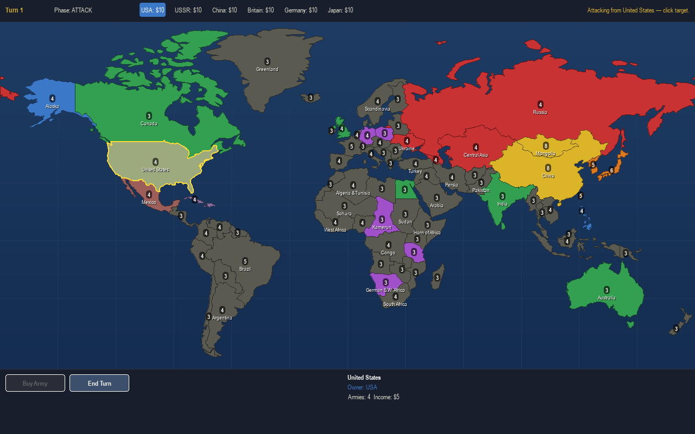
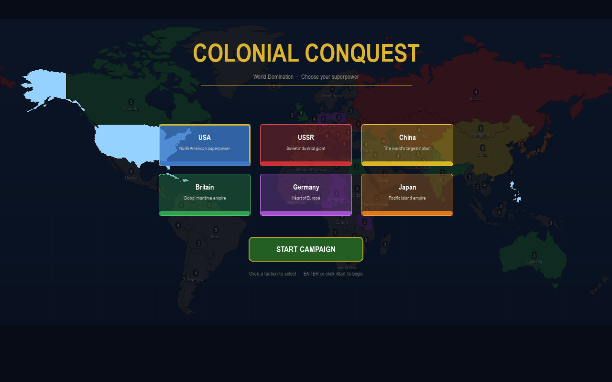

# Colonial Conquest

A modern Python/pygame remake inspired by **Colonial Conquest** (SSI, 1985) — the classic
turn-based world-domination strategy game for the Atari ST. Pick one of six great powers,
build armies, and conquer the world territory by territory.



## Features

- **76 territories with real coastlines** — the world map is generated from Natural Earth
  satellite-derived country boundaries, grouped into 1900s-colonial-flavored territories
  (Austria-Hungary, the Levant, German East Africa, British India, …)
- **6 playable powers** — USA, USSR, China, Britain, Germany, Japan — each balanced to the
  same starting income; you play one, the AI plays the rest
- **Turn-based phases** — income → purchase → move → attack, with attacks from all powers
  staged secretly and resolved together at the end of each round
- **Battle resolution theatre** — the map zooms into each contested territory with a
  flicker animation and synthesized gunfire
- **Army commitment slider** — choose exactly how many armies to move or send into battle
- **Map navigation** — zoom with the mouse wheel (centered on the cursor) and pan by
  dragging the map with any mouse button or with the arrow keys
- **Victory by domination** — control 65 % of the world to win; lose your last territory
  and you're out



## Installation

Requires Python 3.10+.

```bash
pip install -r requirements.txt
python main.py
```

`numpy` is optional — if present, battles get a synthesized gunfire sound effect.

## How to play

1. Pick your faction on the title screen.
2. **Purchase phase** — click *Buy Army* (1 gold each), then click your territories to
   place the new armies. Unplaced armies are auto-placed on your capital.
3. **Move phase** — click one of your territories (2+ armies), then a friendly neighbor,
   and choose how many armies to transfer.
4. **Attack phase** — click one of your territories (2+ armies), then an enemy or neutral
   neighbor, and choose your attack force. Attacks are staged and resolved at the end of
   the round, after every power has moved.
5. `ENTER`/`SPACE` advances the phase, `ESC` clears the selection.
6. **Map navigation** — mouse wheel zooms at the cursor; hold any mouse button and move
   to drag the map (a short click still selects); arrow keys pan; `R` resets to the
   full-world view.

Richer neutral territories defend harder — and watch the sea lanes: invasions can come by
ship (e.g. Brazil ↔ West Africa, Japan ↔ Korea).

## Project structure

```
main.py                    game loop, input handling, game-over flow
config.py                  screen, colors, balance constants
game/
  world.py                 map projection (Miller), hit-testing, victory check
  territory.py             Territory dataclass (geometry + adjacency + state)
  turn.py                  phase/player sequencing
  combat.py                dice-based battle resolution
  ai.py                    AI purchase/move/attack heuristics
  player.py, faction.py, events.py
ui/
  map_view.py              map rendering (ocean, territories, labels, badges)
  hud.py, renderer.py      top bar, bottom panel, buttons
  menu.py                  title screen / faction selection
  amount_dialog.py         army amount slider modal
  battle_animation.py      end-of-round zoom/flicker battle sequence
  gameover.py              victory/defeat screen
data/
  territories.py           GENERATED — do not edit by hand
  raw/countries-110m.json  Natural Earth 110m boundaries (world-atlas TopoJSON)
tools/
  build_territories.py     map generator — regenerates data/territories.py
```

## The map generator

`data/territories.py` is produced by `tools/build_territories.py`, which:

1. decodes the Natural Earth TopoJSON and groups 177 countries into 76 game territories,
2. merges each group's polygons by cancelling shared internal borders,
3. **derives land adjacency automatically from shared borders** (one-way borders are
   impossible by construction),
4. adds hand-defined sea links, splits antimeridian-crossing rings, and validates that
   the territory graph is fully connected.

To change the map (territory groupings, owners, incomes, sea links), edit the config
tables at the top of the generator and rerun:

```bash
python tools/build_territories.py
```

## Credits

- Map boundary data: [Natural Earth](https://www.naturalearthdata.com/) (public domain),
  via [world-atlas](https://github.com/topojson/world-atlas)
- Inspired by *Colonial Conquest* © 1985 Strategic Simulations, Inc. This is an
  unaffiliated fan remake for educational purposes.
